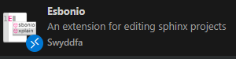
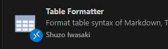

.. _Grammar:

##############################################################################
4. 常用语法
##############################################################################

4.1 基础语法
***************************************

4.1.1 文件标题
=======================================

放在每一个rst文件的最上面

::

    ##############################################################################
    Chapter
    ##############################################################################

4.1.2 标题
=======================================

::

    一级标题
    ******************************

    二级标题
    ==============================

    三级标题
    ~~~~~~~~~~~~~~~~~~~~~~~~~~~~~~

    四级标题
    ------------------------------

    五级标题
    ^^^^^^^^^^^^^^^^^^^^^^^^^^^^^^

    六级标题
    """"""""""""""""""""""""""""""

4.1.3 强调
=======================================

**加粗**

*斜体*

::
    
    **加粗**

    *斜体*

4.1.4 字体大小
=======================================

:xx-large:`巨大`

:x-large:`大`

:larger:`一般大`

:large:`很一般大`

:small:`小`

:smaller:`一般小`

:x-small:`很一般小`

:xx-small:`巨小`

::

    :xx-large:`巨大`

    :x-large:`大`

    :larger:`一般大`

    :large:`很一般大`

    :small:`小`

    :smaller:`一般小`

    :x-small:`很一般小`

    :xx-small:`巨小`

4.1.5 字体颜色
=======================================

:red:`红`

:yellow:`黄`

:orange:`橙`

:blue:`蓝`

:green:`绿`

::

    :red:`红`

    :yellow:`黄`

    :orange:`橙`

    :blue:`蓝`

    :green:`绿`

4.1.6 换行
==================

| 换行
| 换行

::

    | 换行
    | 换行

也可以空两行来换行

换行

换行

::

    换行

    换行

4.1.7 文字居中
==================

使用.. centered::指令居中文字

.. centered:: 文字居中

::

    .. centered:: 文字居中

4.1.8 提示信息
==================

.. list-table::

    * - `.. note::`
      - 注意事项

    * - `.. hint::`
      - 提示或建议

    * - `.. tip::`
      - 实用技巧或捷径

    * - `.. warning::`
      - 警告

    * - `.. danger::`
      - 危险

    * - `.. important::`
      - 关键信息强调

    * - `.. attention::`
      - 需要注意的内容

    * - `.. error::`
      - 错误说明

    * - `.. caution::`
      - 谨慎操作

    * - `.. admonition::`
      - 自定义内容

示例：

.. note::       注意事项

.. hint::       提示或建议

.. tip::        实用技巧或捷径

.. warning::    警告

.. danger::     危险

.. important::  关键信息强调

.. attention::  需要注意的内容        

.. error::      错误说明                

.. caution::    谨慎操作

.. admonition:: 自定义信息

    自定义内容

4.1.9 公式
======================================

.. math:: 
    
    s = v/t

::

    .. math:: 
        
        s = v/t

.. math::

   \boldsymbol{\frac{(V_1 - V_o)}{R_1}} \boldsymbol{+} \boldsymbol{\frac{(V_2 - V_o)}{R_2}} \boldsymbol{+} \boldsymbol{\frac{(V_3 - V_o)}{R_3}} \boldsymbol{=} \boldsymbol{0}

::

    .. math::

        \boldsymbol{\frac{(V_1 - V_o)}{R_1}} \boldsymbol{+} \boldsymbol{\frac{(V_2 - V_o)}{R_2}} \boldsymbol{+} \boldsymbol{\frac{(V_3 - V_o)}{R_3}} \boldsymbol{=} \boldsymbol{0}

4.1.10 列表
=======================================

有序列表
---------------------------------------

1. h
#. e
#. a
#. d
#. s
#. o
#. m
#. e

::

    1. h
    #. e
    #. a
    #. d
    #. s
    #. o
    #. m
    #. e

无序列表
---------------------------------------

- h
- e
- a
- d
- s
- o
- m
- e

::

    - h
    - e
    - a
    - d
    - s
    - o
    - m
    - e

4.1.11 表格
=======================================

列表式(推荐)
---------------------------------------

.. list-table:: syc
    :widths: 1 1 1
    :header-rows: 1

    * - 第一行第一个
      - 第一行第二个
      - 第一行第三个
    
    * - 第二行第一个
      - 第二行第二个
      - 第二行第三个
    
    * - 第三行第一个
      - 第三行第二个
      - 第三行第三个
    
        格内换行
    
    * - 第四行第一个
      - 第四行第二个
      - 第四行第三个

::

    .. list-table:: syc(表格名)
        :widths: 1 1 1 (列宽度的比值)  
        :header-rows: 1 (0为第一行不加粗,1为加粗,默认为0)

        * - 第一行第一个
          - 第一行第二个
          - 第一行第三个
        
        * - 第二行第一个
          - 第二行第二个
          - 第二行第三个
        
        * - 第三行第一个
          - 第三行第二个
          - 第三行第三个
        
            格内换行
        
        * - 第四行第一个
          - 第四行第二个
          - 第四行第三个
     
简易表格
--------------------------------------------------------------------------------

=======  ========  =======
第一行    1         2
=======  ========  =======
第二行    1         2
第三行    1         2
第四行    1         2
第五行    1         2
=======  ========  =======

:: 

    =======  ========  =======
    第一行    1         2
    =======  ========  =======
    第二行    1         2
    第三行    1         2
    第四行    1         2
    第五行    1         2
    =======  ========  =======

CSV表格
--------------------------------------------------------------------------------

.. csv-table:: syc
    :header: "s", "y", "c"
    :widths: 15, 10, 30

    "第一行", 1, 2
    "第二行", 1, 2
    "第三行", 1, 2

::

    .. csv-table:: syc (表格名)
        :header: "s", "y", "c"
        :widths: 15, 10, 30

        "第一行", 1, 2
        "第二行", 1, 2
        "第三行", 1, 2

网格式表格
-----------------------------------------------------------------------------------------

+-------+-----+-----+
| one   | 1   | 2   |
+-------+-----+-----+
| two   | 1   | 2   |
+-------+-----+-----+
| three | 1   | 2   |
+-------+-----+-----+
| four  | 1   | 2   |
+-------+-----+-----+
| five  | 1   | 2   |
+-------+-----+-----+

::

    +-------+-----+-----+
    | one   | 1   | 2   |
    +-------+-----+-----+
    | two   | 1   | 2   |
    +-------+-----+-----+
    | three | 1   | 2   |
    +-------+-----+-----+
    | four  | 1   | 2   |
    +-------+-----+-----+
    | five  | 1   | 2   |
    +-------+-----+-----+

网格式表格较为灵活,可以根据需求设计表格的形状,例如: 

+-------+-----+-----+
| one   | two |three|
+-------+-----+-----+
| two   |           |
+-------+           |
| three |           |
+-------+           |
| four  |           |
+-------+           |
| five  |           |
+-------+-----------+

::

    +-------+-----+-----+
    | one   | two |three|
    +-------+-----+-----+
    | two   |           |
    +-------+           |
    | three |           |
    +-------+           |
    | four  |           |
    +-------+           |
    | five  |           |
    +-------+-----------+

- 在vscode可安装插件Table Formatter方便格式化表格, 安装后通过Ctrl-Shift-P调用 Table: Format Current 或 Table: Format All, 详情跳转 :ref:`Table Formatter <freenove_sphinx_rst/codes/tutorial/tools:table formatter>`

- 也可以使用我写的脚本工具， 绘制想要的表格形状， 详情跳转 :ref:`sphinx表格生成器 <freenove_sphinx_rst/codes/tutorial/tools:freenove sphinx表格生成器>`

定义表格样式
-----------------------------------------------

官方提供了属性可以简单控制表格的样式

可以控制表格的位置和宽度等，这里只讲解常用的位置和宽度

位置
^^^^^^^^^^^^^^^^^^^^^^^^^^^^^

使用MD语法中常用的align属性

.. table::
   :align: left

   +-------+-----+-----+
   | one   | 1   | 2   |
   +=======+=====+=====+
   | two   | 1   | 2   |
   +-------+-----+-----+
   | three | 1   | 2   |
   +-------+-----+-----+

.. table::
   :align: center

   +-------+-----+-----+
   | one   | 1   | 2   |
   +=======+=====+=====+
   | two   | 1   | 2   |
   +-------+-----+-----+
   | three | 1   | 2   |
   +-------+-----+-----+

.. table::
   :align: right

   +-------+-----+-----+
   | one   | 1   | 2   |
   +=======+=====+=====+
   | two   | 1   | 2   |
   +-------+-----+-----+
   | three | 1   | 2   |
   +-------+-----+-----+

::

    .. table::
        :align: left

        +-------+-----+-----+
        | one   | 1   | 2   |
        +=======+=====+=====+
        | two   | 1   | 2   |
        +-------+-----+-----+
        | three | 1   | 2   |
        +-------+-----+-----+

    .. table::
        :align: center

        +-------+-----+-----+
        | one   | 1   | 2   |
        +=======+=====+=====+
        | two   | 1   | 2   |
        +-------+-----+-----+
        | three | 1   | 2   |
        +-------+-----+-----+

    .. table::
        :align: right

        +-------+-----+-----+
        | one   | 1   | 2   |
        +=======+=====+=====+
        | two   | 1   | 2   |
        +-------+-----+-----+
        | three | 1   | 2   |
        +-------+-----+-----+

宽度
^^^^^^^^^^^^^^^^^^^^^^^^^^^^^

.. table::
   :width: 100%

   +-------+-----+-----+
   | one   | 1   | 2   |
   +=======+=====+=====+
   | two   | 1   | 2   |
   +-------+-----+-----+
   | three | 1   | 2   |
   +-------+-----+-----+

.. table::
   :width: 50%

   +-------+-----+-----+
   | one   | 1   | 2   |
   +=======+=====+=====+
   | two   | 1   | 2   |
   +-------+-----+-----+
   | three | 1   | 2   |
   +-------+-----+-----+

.. table::
   :width: 20%

   +-------+-----+-----+
   | one   | 1   | 2   |
   +=======+=====+=====+
   | two   | 1   | 2   |
   +-------+-----+-----+
   | three | 1   | 2   |
   +-------+-----+-----+

::

    .. table::
        :width: 100%

        +-------+-----+-----+
        | one   | 1   | 2   |
        +=======+=====+=====+
        | two   | 1   | 2   |
        +-------+-----+-----+
        | three | 1   | 2   |
        +-------+-----+-----+

    .. table::
        :width: 50%

        +-------+-----+-----+
        | one   | 1   | 2   |
        +=======+=====+=====+
        | two   | 1   | 2   |
        +-------+-----+-----+
        | three | 1   | 2   |
        +-------+-----+-----+

    .. table::
        :width: 20%

        +-------+-----+-----+
        | one   | 1   | 2   |
        +=======+=====+=====+
        | two   | 1   | 2   |
        +-------+-----+-----+
        | three | 1   | 2   |
        +-------+-----+-----+

特殊表格形式（重要！）
-----------------------------------------------------------------------------------------

我用CSS定义了一个在word常用的表格样式，使用时声明freenove-ow类即可，该类默认表格居中。

.. table::
   :class: freenove-ow

   +-------+-----+-----+
   | one   | 1   | 2   |
   +=======+=====+=====+
   | two   | 1   | 2   |
   +-------+-----+-----+
   | three | 1   | 2   |
   +-------+-----+-----+

::

    .. table::
       :class: freenove-ow

       +-------+-----+-----+
       | one   | 1   | 2   |
       +=======+=====+=====+
       | two   | 1   | 2   |
       +-------+-----+-----+
       | three | 1   | 2   |
       +-------+-----+-----+

4.2 代码显示及高亮
******************************************

4.2.1 引用本地代码文件
===============================

显示整个文件：

.. literalinclude:: ../../../key_pad/key_pad.ino
    :linenos:
    :language: c
    :dedent:

::

    .. literalinclude:: ../../../key_pad/key_pad.ino
        :linenos:
        :language: c
        :dedent:
    
只显示代码片段:

.. literalinclude:: ../../../key_pad/key_pad.ino
    :linenos:
    :language: c
    :lines: 11-15
    :dedent:

.. literalinclude:: ../../../key_pad/key_pad.ino
    :linenos:
    :language: c
    :lines: 11, 15
    :dedent:

::

    .. literalinclude:: ../../../key_pad/key_pad.ino
        :linenos:
        :language: c
        :lines: 11-15
        :dedent:

    .. literalinclude:: ../../../key_pad/key_pad.ino
        :linenos:
        :language: c
        :lines: 11, 15
        :dedent:

4.2.2 代码高亮
===============================

高亮第二行和第四行

.. literalinclude:: ../../../key_pad/key_pad.ino
    :linenos:
    :language: c
    :lines: 11-15
    :emphasize-lines: 2, 4
    :dedent:

高亮第二行至第四行

.. literalinclude:: ../../../key_pad/key_pad.ino
    :linenos:
    :language: c
    :lines: 11-15
    :emphasize-lines: 2-4
    :dedent:

::

    .. literalinclude:: ../../../key_pad/key_pad.ino
        :linenos:
        :language: c
        :lines: 11-15
        :emphasize-lines: 2, 4
        :dedent:

    .. literalinclude:: ../../../key_pad/key_pad.ino
        :linenos:
        :language: c
        :lines: 11-15
        :emphasize-lines: 2-4
        :dedent:
    
4.3 显示图片
********************

4.3.1 直接显示图片
===================================

控制图片大小

.. image:: ../_static/imgs/freenove.png
    :width: 10%

.. image:: ../_static/imgs/freenove.png
    :width: 30%

.. image:: ../_static/imgs/freenove.png
    :width: 50%

:: 

    .. image:: ../_static/imgs/freenove.png
        :widths: 10%

    .. image:: ../_static/imgs/freenove.png
        :widths: 20%

    .. image:: ../_static/imgs/freenove.png
        :widths: 30%

控制图片位置

.. image:: ../_static/imgs/freenove.png
    :width: 20%
    :align: left

.. image:: ../_static/imgs/freenove.png
    :width: 20%
    :align: right

.. image:: ../_static/imgs/freenove.png
    :width: 20%
    :align: center

|

::

    .. image:: ../_static/imgs/freenove.png
        :width: 20%
        :align: left

    .. image:: ../_static/imgs/freenove.png
        :width: 20%
        :align: right

    .. image:: ../_static/imgs/freenove.png
        :width: 20%
        :align: center

4.3.2 表格内显示图片
===================================

此处只以网格式及列表式两种常用的表格作为例子讲解

网格式：

+-----------+------------------+-----------------+
| Esbonib   | reStructuredText | Table Formatter |
+===========+==================+=================+
| |Net00|   | |Net01|          | |Net02|         |
+-----------+------------------+-----------------+

::

    +-----------+------------------+-----------------+
    | Esbonib   | reStructuredText | Table Formatter |
    +===========+==================+=================+
    | |Net00|   | |Net01|          | |Net02|         |
    +-----------+------------------+-----------------+

    .. |Net00| image:: ../_static/imgs/Environment/Envi00.png
    .. |Net01| image:: ../_static/imgs/Environment/Envi01.png
    .. |Net02| image:: ../_static/imgs/Environment/Envi02.png

列表式：

.. list-table:: 
    :header-rows: 1 

    * - Esbonib
      - reStructuredText
      - Table Formatter

    * - |List00|
      - |List01|
      - |List02| 

::

    .. list-table:: 
        :header-rows: 1 

        * - Esbonib
          - reStructuredText
          - Table Formatter

        * - |List00|
          - |List01|
          - |List02| 

    .. |List00| image:: ../_static/imgs/Environment/Envi00.png
    .. |List01| image:: ../_static/imgs/Environment/Envi01.png
    .. |List02| image:: ../_static/imgs/Environment/Envi02.png

4.4 超链接
**********************

4.4.1 引用外部链接
======================

`Freenove <https://github.com/Freenove>`_

::

    `Freenove <https://github.com/Freenove>`_

4.4.2 引用内部链接
======================

直接使用内置语法
----------------------

分成两步, 创建锚点和引用锚点

在需要跳转的目的地的前面创建一个锚点, 这个锚点在网页中不可见

::

    .. _Grammar:

使用ref标签跳转到锚点, 这里以跳转到本章节的最前面作为例子

:ref:`Jump <Grammar>`

:: 

    :ref:`Jump <Grammar>`

使用Sphinx提供的插件
----------------------

使用该插件后, 会自动对每一个标题生成一个唯一的标签, 直接引用这个标签

:ref:`Jump <freenove_sphinx_rst/codes/tutorial/common_grammar:4. 常用语法>`

:: 

    :ref:`Jump <freenove_sphinx_rst/codes/tutorial/common_grammar:4. 常用语法>`

4.5 播放视频
********************************************************************************

只讲解播放youtube视频的方法, 更换视频只需要更改视频的ID即可

.. raw:: html

   <iframe height="500" width="690" src="https://www.youtube.com/embed/4pTAqlxHffI" frameborder="0" allowfullscreen></iframe>

|

:: 

    .. raw:: html

        <iframe height="500" width="690" src="https://www.youtube.com/embed/4pTAqlxHffI" frameborder="0" allowfullscreen></iframe>

4.6 更多语法
*******************************************************************************

更多语法请参考以下资料

sphinx教程: https://www.sphinx-doc.org/en/master/usage/

read the docs教程: https://docs.readthedocs.com/platform/stable/index.html

restructuredText标记语言: https://zh-sphinx-doc.readthedocs.io/en/latest/rest.html