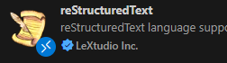
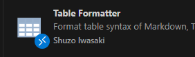

##############################################################################  
2. Environment Setup  
##############################################################################  

2.1 Python Installation  
************************************  

Omitted here, assumed to be already installed.  

`Python reference link <https://blog.csdn.net/qq_53280175/article/details/121107748>`_  

2.2 WSL Installation  
************************************  

Omitted here, assumed to be already installed.  

`WSL reference link <https://blog.csdn.net/wangtcCSDN/article/details/137950545>`_  

2.3 VSCode Installation  
************************************  

Omitted here, assumed to be already installed.  

`VSCode reference link <https://www.runoob.com/vscode/vscode-windows-install.html>`_  

2.3.1 VSCode Plugin Installation  
************************************  

Esbonio
==========================  

.. image:: ../_static/imgs/Environment/Envi00.png  
    :align: center  

reStructuredText
==========================  

Table Formatter
==========================  

Let me know if you'd like any adjustments to the translation!