##############################################################################
3. 本地编译
##############################################################################

本地编译前确保已经安装 WSL, 项目需在 linux 环境下运行

3.1 修改默认用户
*******************************

为免除每次手动切换用户的操作, 可将WSL默认启动用户配置为root账户, 若已配置可 :ref:`跳过 <安装所需依赖>`

在终端中输入以下指令

.. code-block:: console

    vim /etc/wsl.conf

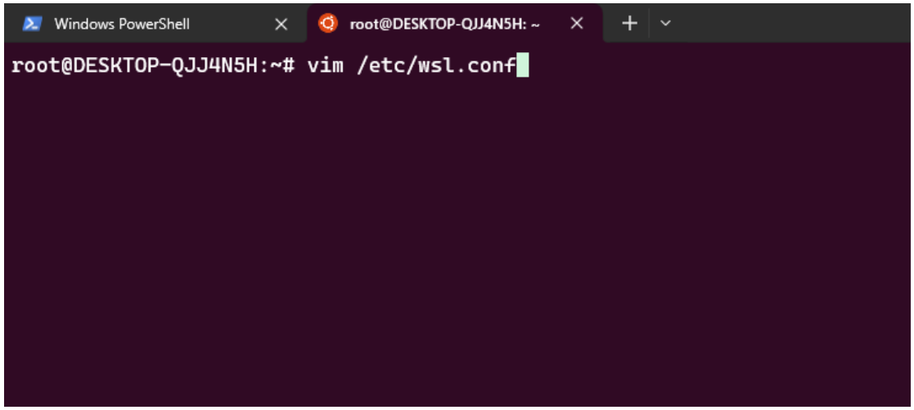

按下键盘上的 "i" 键进入编辑模式, 在文件末尾增加以下代码:

.. code-block:: console

    [user]
    default=root

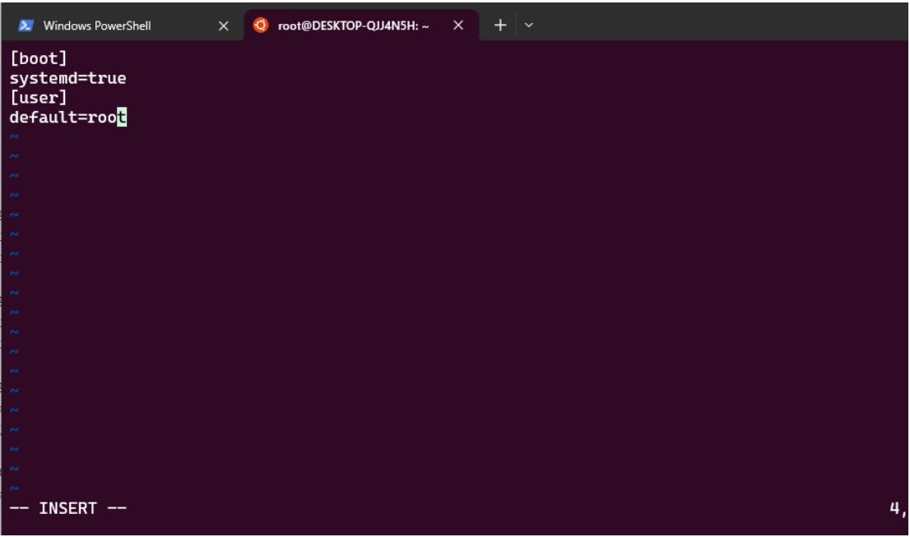

按下 "ESC" 键进入命令行模式, 再输入半角冒号 ":", 再输入 "wq" (保存并退出), 按下回车

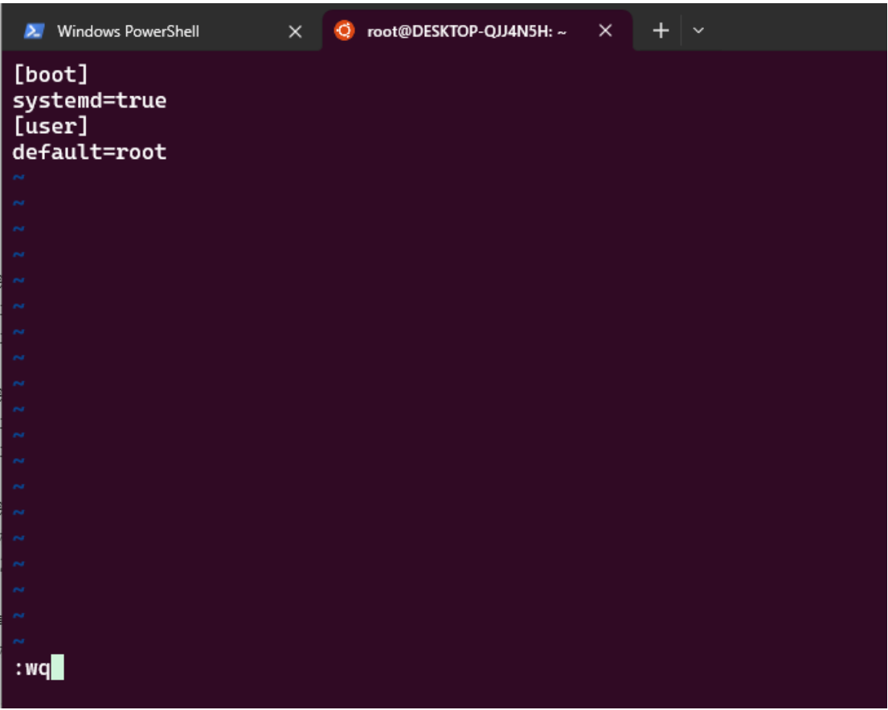

在终端界面重启 wsl, 先输入 "wsl -shutdown", 再输入 "wsl" 启动

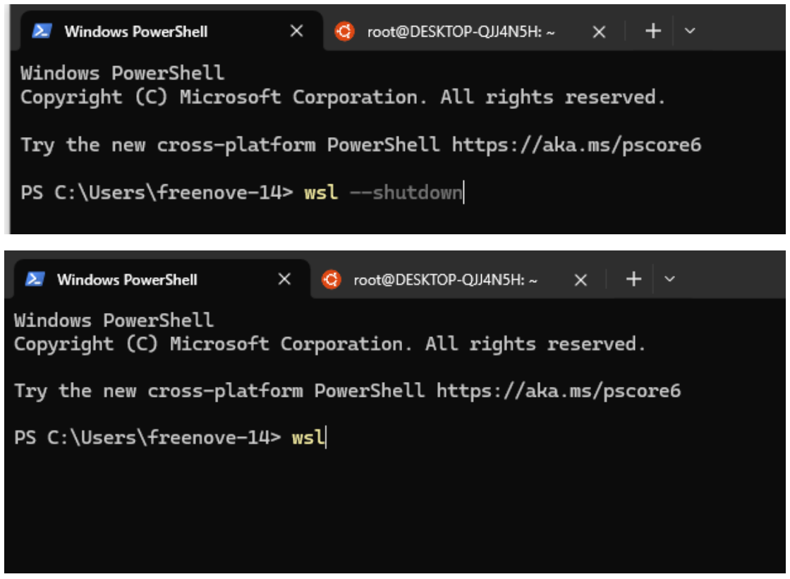

.. _安装所需依赖:

3.2 安装所需依赖
*******************************

在进行本地编译前需要提前安装所需依赖

可使用 :download:`requirements.txt <../../../../requirements.txt>` 文件进行一键安装, 在终端中输入以下指令

.. code-block:: console

    pip install -r requirements.txt

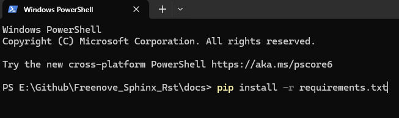

3.3 本地编译 (以本项目为例)
*******************************

打开工程文件夹, 如下图所示:

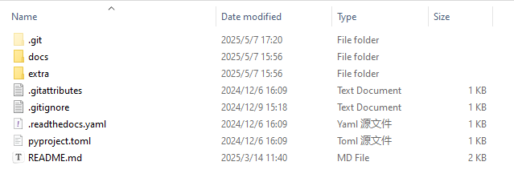

点击鼠标右键, 选择在code中打开

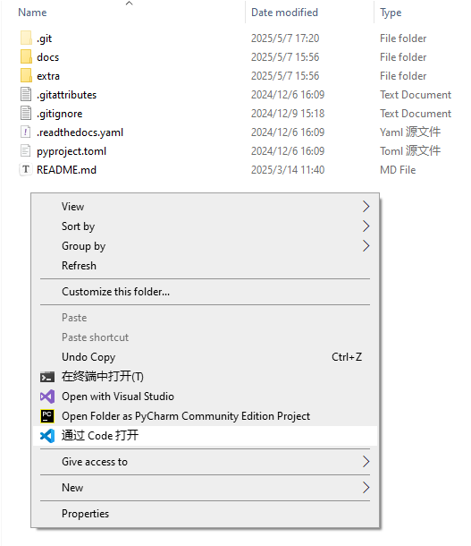

键盘按下 ctrl+shift+p, 选择在 WSL 中重新打开文件夹

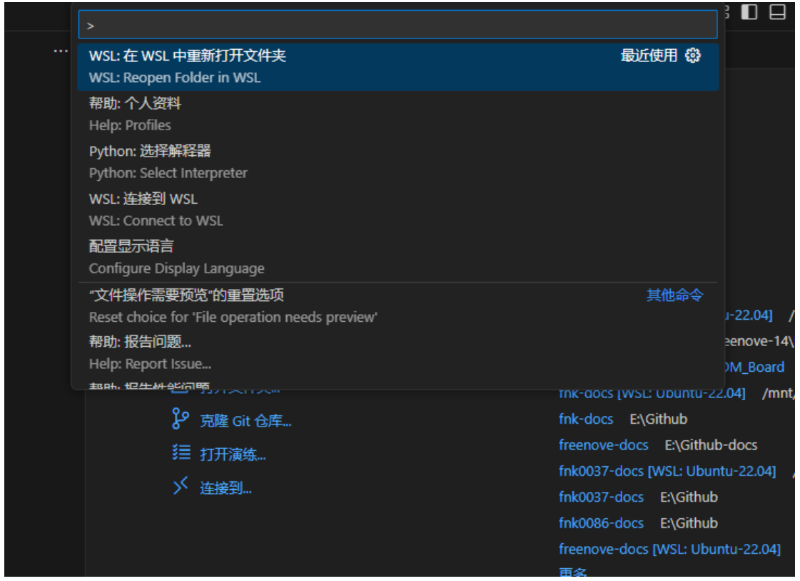

新建一个终端

.. image:: ../_static/imgs/Local_Compilation/Local08.png
    :align: center

输入指令 cd docs 进入 docs 文件夹中

.. code-block:: console

    cd docs

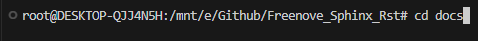

输入指令sphinx-autobuild --pre-build "make clean" --port 1001 source build/html 以启用自动构建。其中, 1001为端口号, 您可以根据需要自行选择, 但请确保所选端口未被其他项目占用, 以避免端口冲突。

.. code-block:: console

    sphinx-autobuild --pre-build "make clean" --port 1001 source build/html

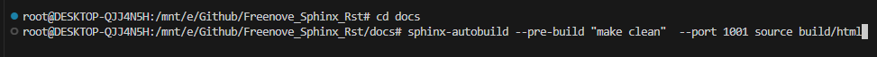

编译完成后出现以下信息, ctrl+鼠标左键在浏览器中浏览文档

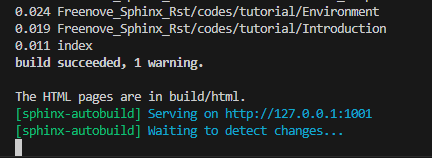