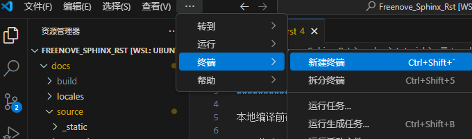

##############################################################################
3. Local Compilation
##############################################################################

Before local compilation, ensure WSL is installed as the project needs to run in a Linux environment.

3.1 Change Default User
*******************************

To avoid manually switching users each time, you can configure WSL to start with the root account by default. If already configured, you can :ref:`skip this step <Install Dependencies>`.

Enter the following command in the terminal:

.. code-block:: console

    vim /etc/wsl.conf

Press "i" on your keyboard to enter edit mode, then add the following code at the end of the file:

.. code-block:: console

    [user]
    default=root

.. image:: ../_static/imgs/Local_Compilation/Local01.png
    :align: center

Press "ESC" to enter command mode, then type a colon ":", followed by "wq" (save and quit), and press Enter.

.. image:: ../_static/imgs/Local_Compilation/Local02.png
    :align: center

Restart WSL by entering "wsl -shutdown" followed by "wsl" in the terminal.

.. image:: ../_static/imgs/Local_Compilation/Local03.png
    :align: center

.. _Install Dependencies:

3.2 Install Required Dependencies
**************************************************************

Install necessary dependencies before local compilation.

You can use the :download:`requirements.txt <../../../../requirements.txt>` file for one-click installation. Enter the following command in the terminal:

.. code-block:: console

    pip install -r requirements.txt

.. note:: 
    
    Make sure to run this command in WSL!

3.3 Local Compilation (Using This Project as Example)
**************************************************************

Open the project folder as shown below:

Right-click and select "Open in Code".

Press Ctrl+Shift+P and choose "Reopen Folder in WSL".

.. image:: ../_static/imgs/Local_Compilation/Local07.png
    :align: center

Create a new terminal.

Enter the command "cd docs" to navigate to the docs folder.

.. code-block:: console

    cd docs

.. image:: ../_static/imgs/Local_Compilation/Local09.png
    :align: center

Enter the command "sphinx-autobuild --pre-build "make clean" --port 1001 source build/html" to enable auto-build. Here, 1001 is the port number - you can choose your own port but make sure it's not being used by other projects to avoid conflicts.

.. code-block:: console

    sphinx-autobuild --pre-build "make clean" --port 1001 source build/html

.. image:: ../_static/imgs/Local_Compilation/Local10.png
    :align: center

After compilation completes, you'll see the following information. Press Ctrl+Left Click to view the documentation in your browser.

