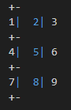
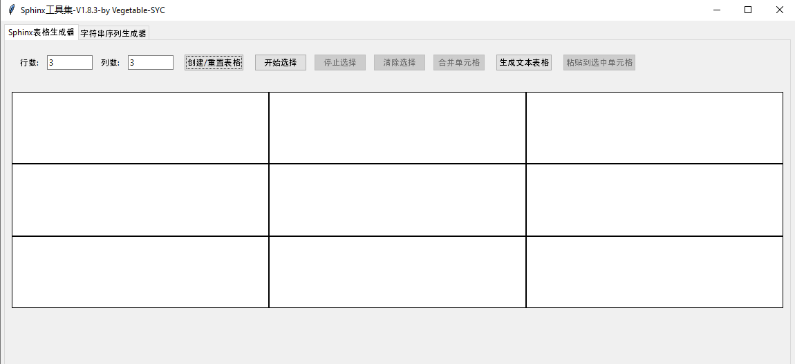
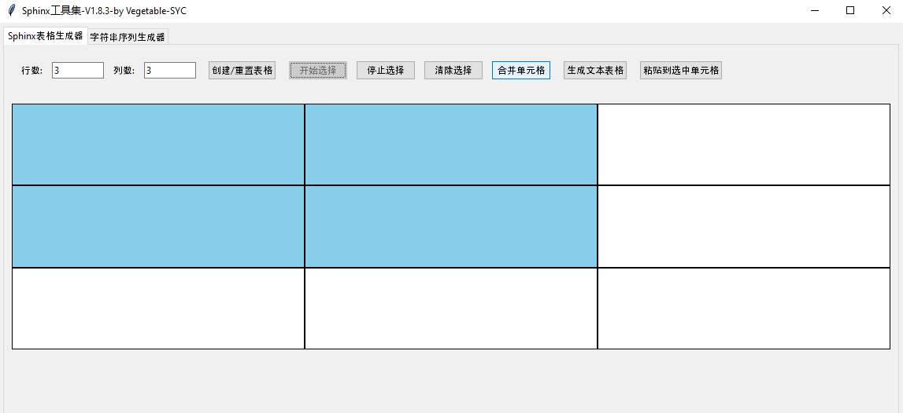
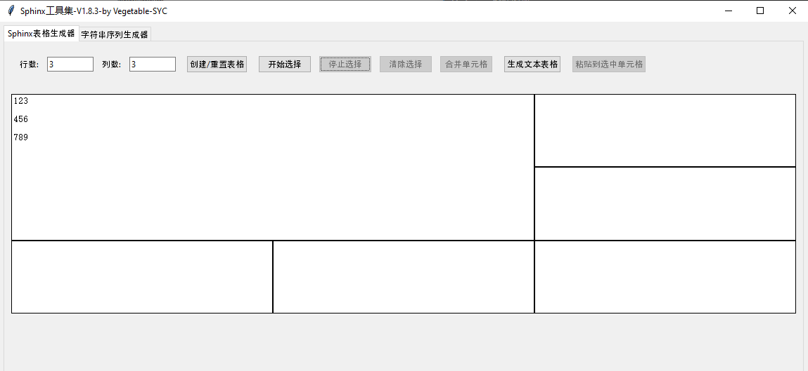
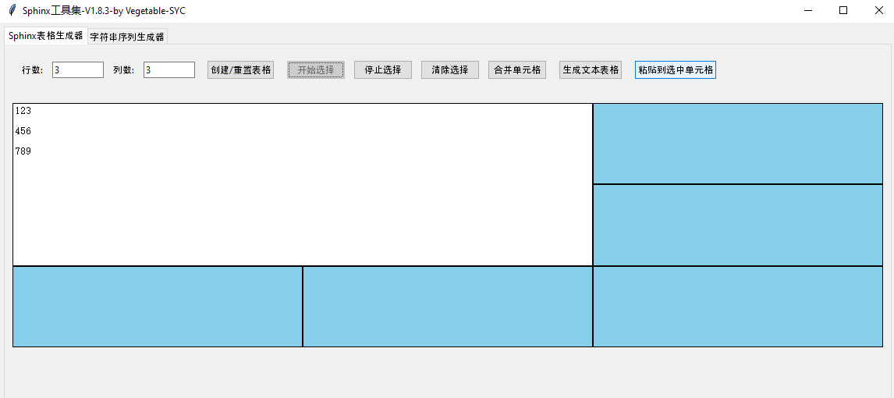
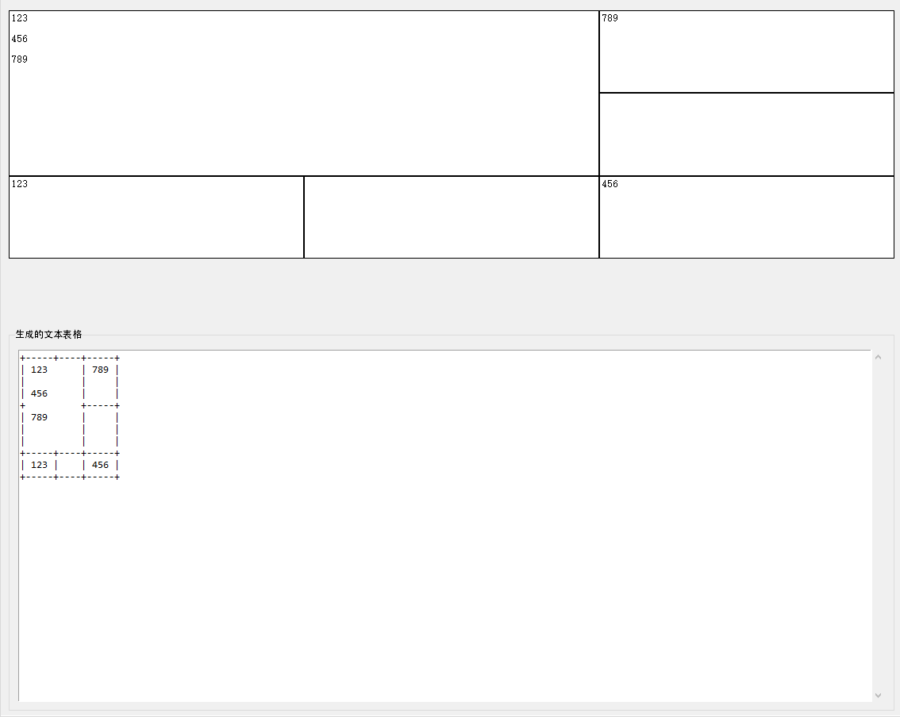
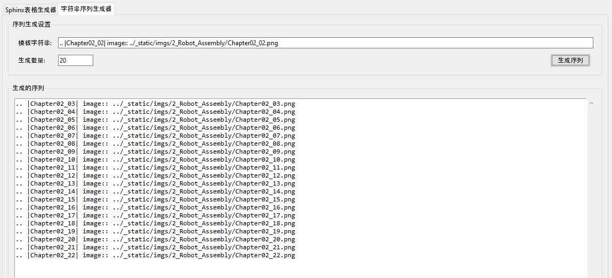

######################################################
5. 工具使用
######################################################

Table Formatter
********************************************

Table Formatter只能生成对称的表格, 即不能合并单元格

使用方法:

使用 "+-" 或 "+=" 分隔行, 用 "|" 分隔列, 如下

**将光标放在表格内**, 使用 **Ctrl + shift + p** 的组合键选择Table: Format Table生成如下表格

+-----+-----+-----+
| 1   | 2   | 3   |
+-----+-----+-----+
| 4   | 5   | 6   |
+-----+-----+-----+
| 7   | 8   | 9   |
+-----+-----+-----+

::

    +-----+-----+-----+
    | 1   | 2   | 3   |
    +-----+-----+-----+
    | 4   | 5   | 6   |
    +-----+-----+-----+
    | 7   | 8   | 9   |
    +-----+-----+-----+

该插件大大增加了网格式表格绘制的效率

Freenove Sphinx表格生成器
********************************************

`点击下载Freenove Sphinx表格生成器 <https://github.com/Vegetable-SYC/Sphinx_Table_Generator/archive/refs/heads/master.zip>`_

Sphinx表格生成器
====================================

表格生成器仅支持生成网格式表格

1、输入对应的行数和列数, 点击创建表格

2、(可选)点击开始选择, 选择需要合并的单元格, 点击合并单元格, 点击停止选择

3、在单元格内输入内容, 单元格内可换行

4、(可选)点击开始选择, 选择需要粘贴的单元格, 点击粘贴到选定单元格实现粘贴到多个单元格, 点击停止选择

5、点击生成文本表格

字符串序列生成器
===================================

字符串序列生成器用于生成显示图片所需的字符串序列

输入模版字符串, 以及生成数量，点击生成序列就可以自动生成

大大提升工作效率

