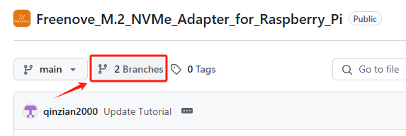
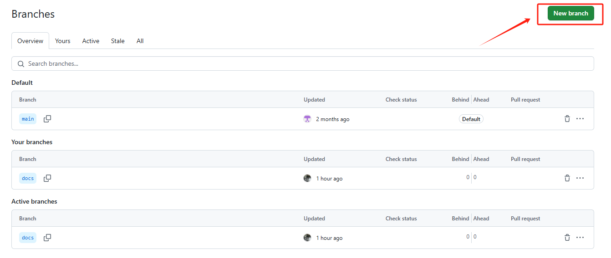
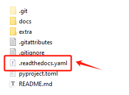

##############################################################################
6. 部署
##############################################################################

上传到GitHub
*********************************************

在项目仓库新建一个分支存放项目文档

命名为docs

线上部署（仅了解）
*********************************************

1、github在对应的仓库创建docs分支

2、上传整个项目到docs分支, 不可以上传错

3、检查

偷懒不写

设置下载格式（仅了解）
*******************************************

修改文档根目录下的yaml文件

设置为可下载所有格式, 包括PDF、EPUB（电子书格式）、HTML

比较推荐HTML格式, PDF格式太丑, EPUB不常用

.. code-block:: yaml
    :linenos:

    formats: all

设置为可下载EPUB及HTML格式

.. code-block:: yaml
    :linenos:

    formats:
     - epub
     - htmlzip

如何下载离线文档（HTML）
*******************************************

后续需要在官网进行声明

首先需要开启
