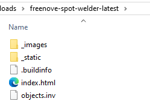

##############################################################################
7. 网页的一些功能介绍
##############################################################################

7.1 自定义功能
*********************************

截止到本文档撰写的时间，线上教程中一共有三个自定义功能

主要的代码结构是JS + css，将HTML的内容嵌入到JS中可以很有效的批量修改，虽然这种写法在实际的前端开发中非常不规范（不利于管理），但在我们的实际开发场景中利大于弊

7.1.1 全文搜索
===================================

在网页的右侧，会有一个放大镜的图标，在通常情况下保持缩小状态，点击后将会展开搜索界面

拖动功能
----------------------------------

在缩小状态下可以随意拖动，但是松开鼠标时，图标将始终贴紧网页右侧！

无论拖动到任何位置展开，搜索界面都不会被遮挡

缩小状态下的放大镜图标被移动后，位置将会被记录，下次进入时放大镜图标也会出现在上次放置的位置

搜索功能
----------------------------------

在搜索框中可以搜索目前完成的线上教程，搜索时支持任意关键字搜索，即可以输入数字或字母，只要匹配都会显示在列表中

建议使用FNK序号检索，效率最高

访问记录功能
----------------------------------

当通过搜索框访问其他文档时，访问记录将会被保存，这个记录并不存放在浏览器缓存中，若希望清除访问记录，可以点击垃圾桶图标使用清除功能

7.1.2 四个圆形按钮
====================================

在文档的右侧，有四个竖直方向排列的按钮

第一个按钮是Freenove github网址

第二个按钮是Freenove 官网

第三个按钮是Freenove youtube频道

第四个按钮是下载当前文档的HTML离线格式

将着重对第四个按钮进行介绍

要想使用此功能需要开启文档的可下载配置

RTD有三种离线保存的格式，分别是epub（电子书格式），html（网页格式），pdf（文档格式）

对文档根目录下的**.readthedocs.yaml**文件进行修改

这个代码的意思是，将文档生成epub和htmlzip格式的离线文件，编译将会被保存在build文件夹中

.. code-block:: yaml

    formats:
       - epub
       - htmlzip

如果希望同时支持所有格式，可以修改为all

.. code-block:: yaml

    formats: all

但是PDF的效果相当不理想，因此文档中只开放了epub和html两种格式，而下载按钮只支持下载html格式，想下载epub格式需要打开网址

.. code-block:: bash

    https://docs.freenove.com/_/downloads/fnk0020/en/latest/epub/

手动下载html格式

.. code-block:: bash

    https://docs.freenove.com/_/downloads/fnk0020/en/latest/htmlzip/

此处仅讲解html格式打开方式：

将下载的压缩包解压到任意目录，打开index.html即可在浏览器打开html格式

7.1.3 RTD新增功能-插件
====================================

链接预览

流量分析

文档通知

全局搜索